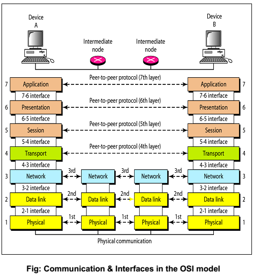

# Open Systems Interconnect (OSI) Model
- https://www.youtube.com/watch?v=o6nrLX6iYT0&t=18s
- https://examradar.com/osi-model-2/communication-interfaces-in-the-osi-model/
- https://www.youtube.com/watch?v=LkolbURrtTs

# Context

## OSI 7-layer Model
Introduced on 1984 by International Organization for Standardization (ISO)
Sending (encapsulation)
Receiving (de-encapsulation)

|                       |
| :--:                                                                                 |
| Credit: https://examradar.com/osi-model-2/communication-interfaces-in-the-osi-model/ |

## Layer 7 - Application Layer (data)
- Purpose
    - Provides network application Service
- Protocols
    - File Transfer Protocol (FTP)
    - HyperText Transfer Protocol (HTTP)
    - HyperText Transfer Protocol Secure (HTTPS)
    - Simple Mail Transfer Protocol (SMTP)
    - Dynamic Host Configuration Protocol (DHCP)
    - Domain Name System (DNS)
    - Telnet

## Layer 6 - Presentation Layer (data)
Data representation and encryption
- Purpose
    - Translate data from application layer from human understandable characters to machine understandable binary code
    - Compress data to make data transfer faster
    - Encrypt data to maintain integrity of data during the process
    - Data format
- Protocols
    - Secure Socket Layer (SSL)
    - Wired Equivalent Privacy (WEP)
    - Wi-Fi Protected Access (WPA)

## Layer 5 - Session Layer (data)
Start/Terminate connection/sessions with Application Programming Interfaces (APIs)
- Purpose
    - Authentication: Username and password to access the server
    - Authorization: Permission to access the files
    - Session Management: Keep track of data packets
- Protocols
    - L2TP
    - RTCP
    - H.245

## Layer 4 - Transportation Layer (segments)
Service to service
- Purpose
    - Segmentation: Divide data from session layer into segments
        - Port Number: Direct segments to the right application
            - e.g Port 80=HTTP, 21=FTP
        - Sequence Number: Reassemble segments to original data
    - Flow Control: Control amount of transmitted data
    - Error Control: Request for missing/corrupted data to be retransmitted
        - Automatic Repeat Request schemes
- Protocols
    - Transmission Control Protocol (TCP)
        - For connection-oriented transmission e.g. FTP, Email and etc.
        - Done by TCP 3-way handshake
    - User Datagram Protocol (UDP)
        - For connectionless transmission e.g. TFTP, DNS and etc.

## Layer 3 - Network Layer (packets)
End to end
- Purpose
    - Logical Addressing: Assign sender's and receiver's IP addresses to each segment from transport layer
        - Protocols: Internet Protocol (IP) e.g. IPv4, IPv6
            - IPv4: 32 bits, represented as 4 octets, each 0-255 (XX,XX,XX,XX)
    - Routing: Determine path to send the packet if computers are in different networks
        - Path Determination Protocols: Choose best path based on the routing protocols
            - e.g. OSPF, EIGRP, RIP, BGP, IS-IS
- Protocols
    - Internet Protocol (IP)
    - Interrnet Control Message Protocol (ICMP)
    - Open Shortest Path First (OSPF)
    - Enhanced Interior Gateway Routing Protocol (EIGRP)
    - Routing Information Protocol (RIP)
    - Border Gateway Protocol (BGP)
    - Intermediate System to Intermediate System (IS-IS)
- Hardware
    - Routers
    - Hosts

## Layer 2 - Data Link Layer (frames)
Hop to hop
- Purpose
    - Physical Addressing: Assign sender's and receiver's Media Access Control (MAC) addresses to each packet from network layer
        - MAC addresses
            - 48 bits, represented as 12 hex digits (XX:XX:XX:XX:XX:XX)
    - Media Accesscess Control and Error Detection
- Protocols
    - Address Resolution Protocol (ARP)
    - Point-to-Point over Ethernet (PPPoE)
- Hardware
    - Network Interface Cards (NIC)
    - Wi-Fi Access Cards
    - Switches
    - Bridges
    - Wireless Access Point (AP)

## Layer 1 - Physical Layer (bits)
Transport bits
- Purpose
    - Transmit signal bits to receiver
    - Receive signals in bits
- Hardware Media
    - Electric signal: Copper wire
    - Light signal: Optical fiber
    - Radio signal: Air
