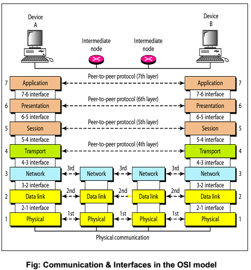

- __Tags__: #OSI #Networking
- __Vimwiki__: :OSI:Networking:

# Open Systems Interconnect (OSI) Model

- https://www.youtube.com/watch?v=o6nrLX6iYT0&t=18s
- https://examradar.com/osi-model-2/communication-interfaces-in-the-osi-model/
- https://www.youtube.com/watch?v=LkolbURrtTs

# Context

## OSI 7-layer Model

Introduced on 1984 by International Organization for Standardization (ISO)
Sending (encapsulation)
Receiving (de-encapsulation)

|                                       |
| -------------------------------------------------------------------------------------------------------------------------- |
| Credit: https://examradar.com/osi-model-2/communication-interfaces-in-the-osi-model/                                       |

## Layer 7 - Application Layer (data)

- Purpose
  - Provides network application Service
- Protocols
  - File Transfer Protocol (FTP)
  - HyperText Transfer Protocol (HTTP)
  - HyperText Transfer Protocol Secure (HTTPS)
  - Simple Mail Transfer Protocol (SMTP)
  - Dynamic Host Configuration Protocol (DHCP)
  - Domain Name System (DNS)
  - Telnet

## Layer 6 - Presentation Layer (data)

Data representation and encryption

- Purpose
  - Translate data from application layer from human understandable characters to machine understandable binary code
  - Compress data to make data transfer faster
  - Encrypt data to maintain integrity of data during the process
  - Data format
- Protocols
  - Secure Socket Layer (SSL)
  - Wired Equivalent Privacy (WEP)
  - Wi-Fi Protected Access (WPA)

## Layer 5 - Session Layer (data)

Start/Terminate connection/sessions with Application Programming Interfaces (APIs)

- Purpose
  - Authentication: Username and password to access the server
  - Authorization: Permission to access the files
  - Session Management: Keep track of data packets
- Protocols
  - L2TP
  - RTCP
  - H.245

## Layer 4 - Transportation Layer (segments)

Service to service

- Purpose
  - Segmentation: Divide data from session layer into segments
    - Port Number: Direct segments to the right application
      - e.g Port 80=HTTP, 21=FTP
    - Sequence Number: Reassemble segments to original data
  - Flow Control: Control amount of transmitted data
  - Error Control: Request for missing/corrupted data to be retransmitted
    - Automatic Repeat Request schemes
- Protocols
  - Transmission Control Protocol (TCP)
    - For connection-oriented transmission e.g. FTP, Email and etc.
    - Done by TCP 3-way handshake
  - User Datagram Protocol (UDP)
    - For connectionless transmission e.g. TFTP, DNS and etc.

## Layer 3 - Network Layer (packets)

End to end

- Purpose
  - Logical Addressing: Assign sender's and receiver's IP addresses to each segment from transport layer
    - Protocols: Internet Protocol (IP) e.g. IPv4, IPv6
      - IPv4: 32 bits, represented as 4 octets, each 0-255 (XX,XX,XX,XX)
  - Routing: Determine path to send the packet if computers are in different networks
    - Path Determination Protocols: Choose best path based on the routing protocols
      - e.g. OSPF, EIGRP, RIP, BGP, IS-IS
- Protocols
  - Internet Protocol (IP)
  - Interrnet Control Message Protocol (ICMP)
  - Open Shortest Path First (OSPF)
  - Enhanced Interior Gateway Routing Protocol (EIGRP)
  - Routing Information Protocol (RIP)
  - Border Gateway Protocol (BGP)
  - Intermediate System to Intermediate System (IS-IS)
- Hardware
  - Routers
  - Hosts

## Layer 2 - Data Link Layer (frames)

Hop to hop

- Purpose
  - Physical Addressing: Assign sender's and receiver's Media Access Control (MAC) addresses to each packet from network layer
    - MAC addresses
      - 48 bits, represented as 12 hex digits (XX:XX:XX:XX:XX:XX)
  - Media Accesscess Control and Error Detection
- Protocols
  - Address Resolution Protocol (ARP)
  - Point-to-Point over Ethernet (PPPoE)
- Hardware
  - Network Interface Cards (NIC)
  - Wi-Fi Access Cards
  - Switches
  - Bridges
  - Wireless Access Point (AP)

## Layer 1 - Physical Layer (bits)

Transport bits

- Purpose
  - Transmit signal bits to receiver
  - Receive signals in bits
- Hardware Media
  - Electric signal: Copper wire
  - Light signal: Optical fiber
  - Radio signal: Air
