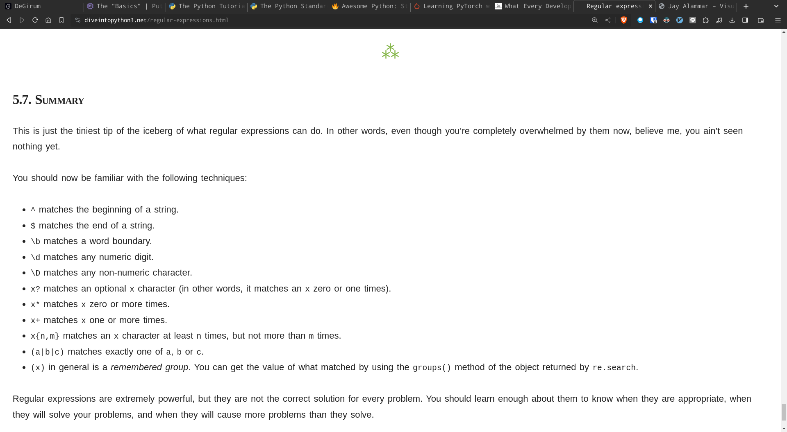

- __Tags__: #Regex
- __Vimwiki__: :Regex:

______________________________________________________________________

# Regex: Regular Expression

- Reference
  - https://regex101.com/
  - http://regexstorm.net/tester
  - https://www.youtube.com/watch?v=dxJHQYtck0k&t=2s
  - https://www.youtube.com/watch?v=VFOj_sjuBmk
  - https://learn.microsoft.com/en-us/dotnet/standard/base-types/regular-expression-language-quick-reference
  - https://blog.poychang.net/note-regular-expression/

# Table of Contents

- [Regex: Regular Expression](#regex-regular-expression)
- [Context](#context)
  - [Character](#character)
  - [Quantifier](#quantifier)
  - [Operator](#operator)
  - [Meta characters](#meta-characters)
  - [Special characters](#special-characters)
  - [Greedy/Lazy Match](#greedylazy-match)
  - [Regex Examples](#regex-examples)
    - [RGB color](#rgb-color)
    - [IPv4 address](#ipv4-address)

Created by [gh-md-toc](https://github.com/ekalinin/github-markdown-toc)

# Context

## Character

- `[a-z]`: characters from a to z
- `[a-zA-z]`: characters from a to z and from A to Z
- `{abc}`: multiple characters abc

## Quantifier

- `?`: once or none
- `+`: once or multiple
- `*`: none, one or multiple
- `{N}`: exactly N times
- `{N, }`: more or equal N times
- `{N_min, N_max}`: N_min to N_max times

## Operator

- `(cat)|(dog)`: OR operation (cat or dog)
- `[^0-9]`: NOT operation (not 0~9)

## Meta characters

- `\r`: carriage return
- `\n`: newline character
- `\t`: tab
- `\f`: form-feed character
- `\v`: Vertical whitespace character
- `\b`: Boundary of matching (same as `\bword`)
- `\e`: Escape
- `\d`: \[0-9\]
- `\w`: \[a-zA-Z0-9\_\]
- `\s`: \[\\r\\n\\t\\f\\v \]
- `\D`: \[^0-9\]
- `\W`: \[^a-zA-Z0-9\_\]
- `\S`: \[^\\r\\n\\t\\f\\v \]

## Special characters

- `.`: Match any characters (including space)
  - i.e. `.*`: Match all line
- `^`: Match beginning of line (BOL)
- `$`: Match end of line (EOL)

## Greedy/Lazy Match

- Greedy Match (default matching strategy)
  - Match as many times as possible
- Lazy Match (also known as non-greedy match and reluctant match):
  - Match with given times (number of question mark)
  - Done by Adding an extra question mark to quantifier
    - e.g. `??`, `*?` or `+?`

## Regex Examples

### RGB color

- Pattern
  - Start with number sign (#) followed by 3 2-digit hex number
- Regex
  - `\b#[a-fA-F0-9]{6}\b`

### IPv4 address

- Pattern
  - 4 0~255 numbers separated by period (.)
- Regex
  - `\b((25[0-5]|2[0-4]\d|1?\d?\d)(\.|$)){4}\b`
    - 0~255 and period for first three numbers
    - 0~255 and EOL for the last number
      1. 255 >= Number >= 250: `25[0-5]`
      1. 249 >= Number >= 200: `2[0-4][0-9]`
      1. 199 >= Number >= 0: `1?\d?\d`
         1. 100~199: `1\d\d`
         1. 10~99: `\d\d`
         1. 0~9: `\d`

## Summary

